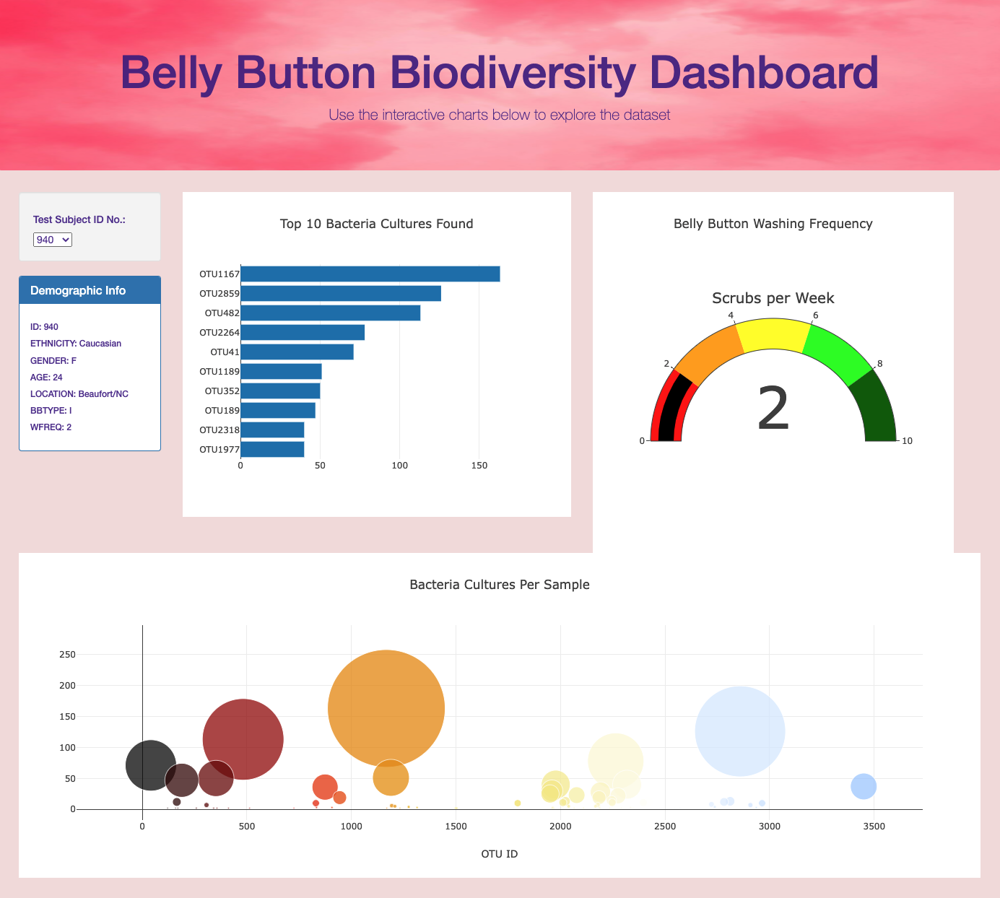

# Plotly_BellyButtonBiodiversity

This new assignment consists of four technical analysis deliverables

- Deliverable 1: Create a Horizontal Bar Chart
- Deliverable 2: Create a Bubble Chart
- Deliverable 3: Create a Gauge Chart
- Deliverable 4: Customize the Dashboard

## Results:
### Overview of Completed Webpage :

### Deliverable 1: Create a Horizontal Bar Chart

Hover Text

### Deliverable 2: Create a Bubble Chart

### Deliverable 3: Create a Gauge Chart

### How webpage loads before customizing 

When the webpage loads, the bar and bubble chart are working according to the requirements in Deliverable 1 and 2, respectively, and the gauge chart is working according to the requirements listed for this Deliverable

### Deliverable 4: Customize the Dashboard

Dashboard customized with the following: 
- Added an image to the jumbotron
- Added background color to the webpage
- webpage is mobile-responsive (layout changed)

